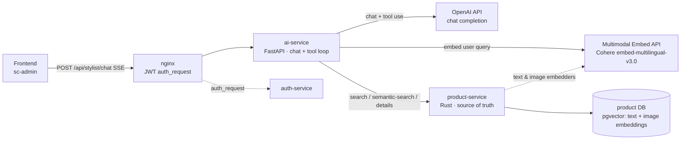
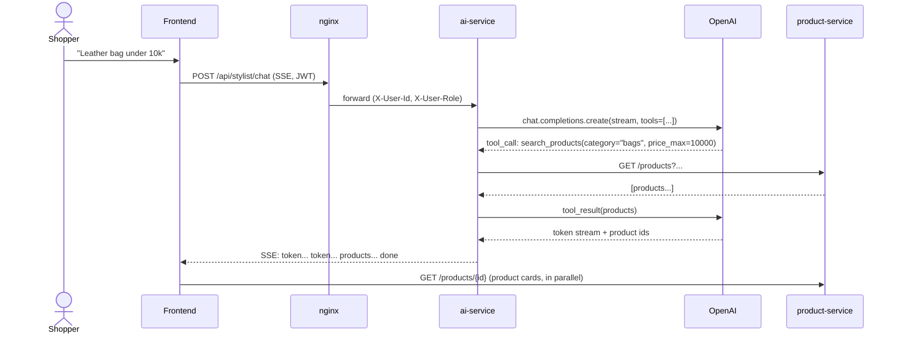

# AI Service Lab

A learning project for building `ai-service` inside the AvaVintage ecosystem.
The goal is an **AI stylist** for shoppers: it takes natural-language
requests, helps pick out products, clarifies preferences, and returns
recommendations backed by real product cards.

Full design lives in [`server/ai-service/DESIGN.md`](server/ai-service/DESIGN.md).

## About this project

This fork is a portfolio piece built to demonstrate **AI-agent-driven
engineering**: the `ai-service` slice — design, phased implementation plan,
code, and tests — was built end-to-end in direct collaboration with an AI
coding agent (Claude Code) rather than hand-written line by line. The
paper trail is in the repo, not just the claim:

- [`server/ai-service/DESIGN.md`](server/ai-service/DESIGN.md) — architecture
  and design decisions, written before implementation.
- [`server/ai-service/plan.md`](server/ai-service/plan.md) — a phased,
  mergeable rollout plan derived from the design.
- Incremental commits that follow that plan phase by phase, with the agent
  doing the driving and a human reviewing, steering, and merging.

Beyond the workflow, the system itself is squarely in agentic-engineering
territory:

- an **LLM tool-use loop** (`llm/loop.py`, `llm/tools.py`) where the model
  calls typed, Pydantic-validated tools (`search_products`,
  `semantic_search`, `get_product_details`, `list_facets`) against a live
  backend, wrapped in budget/rate-limit/circuit-breaker guards;
- a **RAG-style semantic search pipeline** — a shared multimodal embedding
  space (text + product images) feeding hybrid `pgvector` search;
- a **polyglot, containerized microservice system** — Rust (`product-service`,
  `auth-service`, `user-service`), Python/FastAPI (`ai-service`), Angular
  (`sc-admin`), fronted by nginx, all orchestrated via docker-compose.

## What the service does

`ai-service` is a standalone FastAPI service that:

- accepts chat requests from the frontend over SSE;
- uses the OpenAI API for response generation and tool use;
- uses a multimodal embedding model (shared with `product-service`) for
  query embeddings — text and images live in the same vector space;
- calls `product-service` for products, filters, facets, and hybrid
  semantic search (text + image);
- authenticates the user via a JWT issued by `auth-service`;
- keeps conversation history in memory for the MVP;
- returns a text reply plus the ids of recommended products.

MVP's main endpoint:

```text
POST /api/stylist/chat
```

The response streams as events:

```text
token -> token -> products -> done
```

## Architecture



`ai-service` does not keep a copy of the catalog and never talks to the
product DB directly — `product-service` remains the single source of truth
for products.

### Request flow (point search)



For a fuzzy request ("something warm, 90s vibe") the LLM instead calls
`semantic_search`: `ai-service` embeds the query with the same multimodal
model used to index products, `product-service` scores it against pgvector
text- and image-embeddings (`w_text * text_cos + w_image * MAX(image_cos)`),
and returns ranked products with a `score_breakdown`. See
[`DESIGN.md`](server/ai-service/DESIGN.md) for the full sequence diagrams
(semantic search, drill-in, and the embedding indexing pipeline).

## Tech stack

- FastAPI + Uvicorn
- OpenAI Python SDK
- Pydantic
- SSE via `sse-starlette`
- HTTP client to `product-service`
- JWT auth (terminated at nginx)
- In-memory conversations for the MVP

## Product embeddings

Semantic search is designed so that product embeddings belong to
`product-service`. Two `pgvector` tables live in the product DB:

- `product_text_embeddings` — one vector per product, computed from
  `generate_product_text(id)`;
- `product_image_embeddings` — one row per product photo (the
  `medium.webp` variant), aggregated at search time with `MAX`
  cosine-similarity.

Both tables and the query embedding in `ai-service` use the **same**
multimodal embedding model (single joint vector space for text and
images). This lets a text query from chat match directly against a
product's visual features. The chosen provider is **Cohere
`embed-multilingual-v3.0`** (dim 1024) — multilingual out of the box
(catalog and users are Russian-first) with no cloud vendor lock-in.

`ai-service` only embeds the user's query and sends the query vector to
an internal `product-service` endpoint, which computes the hybrid score
and returns products together with a `score_breakdown`.

## Tool use

The LLM can call a constrained set of tools:

- `search_products` — precise filter-based search;
- `semantic_search` — meaning-based search via embeddings;
- `get_product_details` — full product card;
- `list_facets` — real brands, categories, and tags.

All tool arguments are validated with Pydantic.

## MVP limitations

- conversation history is kept only in process memory;
- history is lost on service restart;
- horizontal scaling will require Redis or another external store;
- rate limits and cost guards start out in-memory;
- the text- and image-embedder in `product-service`, pgvector migrations,
  and the hybrid semantic-search endpoint are being built incrementally
  (see `server/ai-service/plan.md`);
- "search by photo" (image upload in chat) is post-MVP — the underlying
  infrastructure is laid down in the MVP, but the tool/UI ships later.
