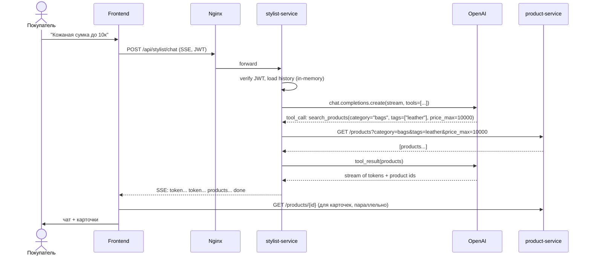
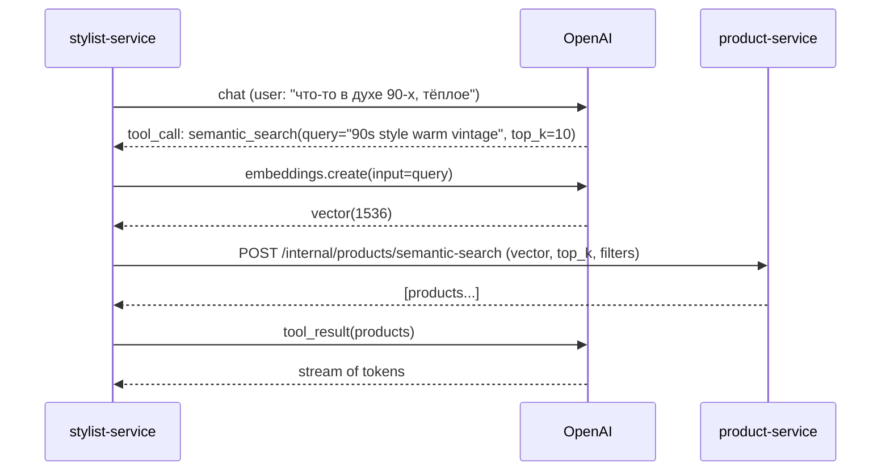
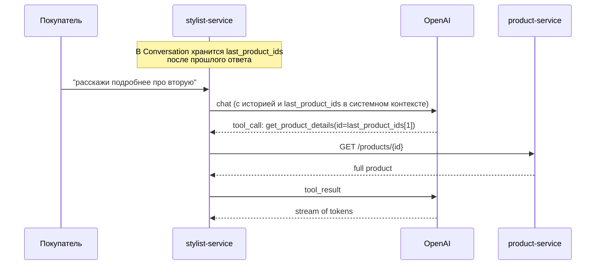
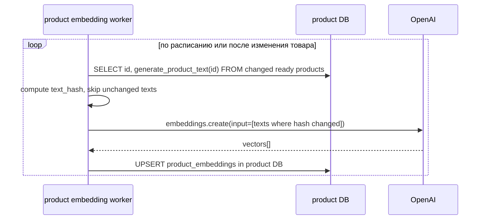

# Stylist Service — дизайн

Сервис-стилист для покупателей: помогает находить товары на естественном языке, рекомендует на основе тегов, категорий, типизированных details и описаний.

## Стек

- **Python 3.12 + FastAPI + Uvicorn (uvloop)** — async, чтобы дёшево держать длинные SSE-стримы.
- **OpenAI Python SDK ≥ 1.30** — `chat.completions.create(stream=True)` с tool use; `embeddings.create` для query-эмбеддингов.
  - Chat-модель по умолчанию: `gpt-4o-mini` (дешёвая для tool-use loop), эскалация на `gpt-4o` через env при необходимости.
  - Embedding-модель: `text-embedding-3-small` (dim=1536). Та же модель используется в `product-service` для product embeddings — векторные пространства должны совпадать.
- **httpx (async)** — клиент к `product-service`: таймауты, exponential backoff, connection pool.
- **sse-starlette** — SSE-стрим в браузер с keep-alive ping.
- **Pydantic v2** — валидация tool-args от LLM и схем входящих/исходящих сообщений.
- **structlog + prometheus_client** — JSON-логи и метрики на `/metrics`.
- **Авторизация: JWT терминируется на nginx** (`auth_request` к `auth-service`, как у остальных сервисов). `stylist-service` читает уже валидные `X-User-Id` и `X-User-Role` из заголовков. Локальный JWT verify — только опционально, как defence-in-depth.

Платформа Python — отдельная от Rust-стека (auth/product/user), потому что вся OpenAI-экосистема (SDK, инструменты для prompt engineering, eval-фреймворки) живёт в Python и Node, и переписывать tool-use loop на Rust — не оправданная цена для MVP.

## Структура каталога

```
server/ai-service/
├── pyproject.toml               # uv / pip деп
├── Dockerfile
├── assets/
│   ├── docker-compose.ai.yml        # dev
│   └── docker-compose.ai.prod.yml   # prod
├── migrations/                  # пусто на MVP (state in-memory), задел на будущее
├── src/ai_service/
│   ├── __init__.py
│   ├── main.py                  # FastAPI app, роутеры, lifespan
│   ├── config.py                # pydantic-settings, чтение env
│   ├── deps.py                  # FastAPI dependencies: current_user, http clients
│   ├── auth.py                  # парсинг X-User-Id / X-User-Role
│   ├── domain/
│   │   ├── conversation.py      # Conversation, Message, ToolCall
│   │   └── errors.py
│   ├── llm/
│   │   ├── client.py            # обёртка над OpenAI SDK + retry
│   │   ├── tools.py             # JSON Schema tool definitions
│   │   ├── prompts.py           # системный промпт, шаблоны
│   │   ├── budget.py            # обрезка истории, summary-сжатие
│   │   └── loop.py              # tool-use цикл: chat -> tool_call -> tool_result -> ...
│   ├── product/
│   │   ├── client.py            # httpx-клиент к product-service
│   │   └── schemas.py           # типы DTO для product-service
│   ├── handlers/
│   │   ├── chat.py              # POST /api/stylist/chat (SSE)
│   │   └── conversations.py     # POST/DELETE /api/stylist/conversations
│   ├── ratelimit.py             # token bucket in-memory
│   └── observability.py         # logging, metrics, request_id middleware
└── tests/
    ├── conftest.py
    ├── unit/
    └── integration/
```

## Конфигурация

Все параметры — через env. Дефолты безопасные для dev, продовые секреты — из `.env` рядом с docker-compose.

| Var | Default | Назначение |
|---|---|---|
| `SERVICE_PORT` | `8084` | HTTP-порт |
| `OPENAI_API_KEY` | — | Обязательно |
| `OPENAI_CHAT_MODEL` | `gpt-4o-mini` | Можно переопределить на `gpt-4o` |
| `OPENAI_EMBED_MODEL` | `text-embedding-3-small` | Должна совпадать с моделью индекса в product-service |
| `OPENAI_REQUEST_TIMEOUT_SECONDS` | `30` | Таймаут одного OpenAI-вызова |
| `PRODUCT_SERVICE_URL` | `http://sc-product-service:8081` | |
| `PRODUCT_SERVICE_TIMEOUT_SECONDS` | `5` | |
| `INTERNAL_API_TOKEN` | — | Shared secret для internal endpoint-ов product-service |
| `MAX_HISTORY_MESSAGES` | `30` | Hard cap до summary-сжатия |
| `HISTORY_TOKEN_BUDGET` | `6000` | Бюджет истории в промпте |
| `MAX_TOOL_ITERATIONS` | `4` | Защита от tool-use зацикливания |
| `MAX_TOKENS_PER_REPLY` | `800` | `max_tokens` в chat completion |
| `RATE_LIMIT_MESSAGES_PER_MIN` | `12` | Per user |
| `RATE_LIMIT_TOKENS_PER_DAY` | `50000` | Per user |
| `EMBEDDINGS_DAILY_CAP` | `10000` | Per service (всего query-эмбеддингов в сутки) |
| `CONVERSATION_TTL_MINUTES` | `30` | TTL in-memory сессии |
| `LOG_LEVEL` | `info` | |
| `JWT_SECRET` | — | Опционально, для локального verify |

## Границы сервиса

```
                      +--------------------------------+
                      | stylist-service (FastAPI :8084) |
                      |                                |
 /api/stylist/chat -> |  - chat handler (SSE)          |
                      |  - conversations               |
                      +---------------+----------------+
                                      |
                    +---------------+---------------+----------------+
                    |                               |                |
                    v                               v                v
             product-service                   OpenAI API       auth-service
             (HTTP, source of truth,           (chat +           (JWT verify
              filters, pgvector)                query embed)      через nginx)
```

JWT валидируется на nginx через `auth_request → /internal/auth/verify` (так же, как для product/user-service). Внутрь `stylist-service` приходят уже подтверждённые `X-User-Id` и `X-User-Role`. История диалогов и rate-limit-счётчики — **in-memory** в процессе `stylist-service`.

## Хранилища

### product-service / product DB

Товары, фильтры, фасеты, текст для эмбеддинга и сами product embeddings принадлежат `product-service`.
Это сохраняет одну точку правды для статусов, soft-delete, размеров, категорий, цен и правил видимости витрины.

В product DB добавляется таблица индекса:

```sql
CREATE EXTENSION IF NOT EXISTS vector;

CREATE TABLE product_embeddings (
    product_id  UUID PRIMARY KEY,
    embedding   vector(1536) NOT NULL,
    text_hash   TEXT NOT NULL,
    updated_at  TIMESTAMPTZ NOT NULL DEFAULT now()
);

CREATE INDEX product_embeddings_hnsw
    ON product_embeddings
    USING hnsw (embedding vector_cosine_ops);
```

`text_hash` — хэш строки, из которой считается эмбеддинг. Если поля товара не изменились так, чтобы хэш сменился, — пересчёт пропускаем.

Текст строится в `product-service` из продуктовой модели. В текущей схеме уже есть helper `generate_product_text(p_product_id)`, который собирает name, brand, category, tags, season, details и `ai_notes`.

`product-service` даёт внутренние endpoint-ы:

| Endpoint | Кто вызывает | Что делает |
|---|---|---|
| `GET /products` | `stylist-service`, frontend | Обычный фильтрованный поиск по товарам |
| `GET /products/{id}` | `stylist-service`, frontend | Полная карточка товара |
| `GET /products/filter-options` | `stylist-service`, frontend | Реальные фасеты для брендов, категорий, размеров и т.д. |
| `POST /internal/products/semantic-search` | `stylist-service` | Принимает query vector + filters, ищет по pgvector внутри product DB |
| `POST /internal/products/{id}/embedding` или worker/job | internal | Пересчитывает и сохраняет embedding товара |

`stylist-service` не имеет прямого доступа к product DB и не хранит копию product embeddings.

#### Контракт internal endpoint-ов

`POST /internal/products/semantic-search`

Заголовки: `X-Internal-Token: <shared-secret>`, опционально `X-User-Id` для применения визибилити-правил.

Запрос:
```json
{
  "vector": [0.012, -0.043, "..."],
  "top_k": 10,
  "filters": {
    "category": "bags",
    "brand": null,
    "tags": ["leather"],
    "size": null,
    "condition": null,
    "price_min": null,
    "price_max": 10000
  }
}
```

Ответ:
```json
{
  "items": [
    {
      "id": "uuid",
      "score": 0.87,
      "name": "Vintage Coach bag",
      "brand": "Coach",
      "category": "bags",
      "price": 5500,
      "highlight_fields": ["leather", "90s", "crossbody"]
    }
  ]
}
```

Контракт фиксирует:
- `vector` — ровно `dim=1536`, иначе `400 invalid_vector_dim`.
- product-service сам отфильтровывает `is_deleted = true` и `status != 'ready'`.
- `score` — cosine similarity, нормированный в `[0, 1]`.
- `highlight_fields` — короткий перечень полей, по которым товар «попал» в выборку (для аргументации LLM).

`POST /internal/products/{id}/embedding` — internal-only. Используется worker-ом `product-service`, не вызывается из `stylist-service`. Описан для полноты в TODO ниже.

## Tool use

Четыре функции, которые LLM может звать:

| Tool | Аргументы | Что делает |
|---|---|---|
| `search_products` | `category?, brand?, tags?, price_min?, price_max?, size?, condition?` | Точечный SQL-фильтр через `product-service` |
| `semantic_search` | `query: str, top_k: int = 10, filters?` | Эмбеддит запрос и вызывает semantic endpoint `product-service` |
| `get_product_details` | `id: UUID` | Полная карточка из `product-service` |
| `list_facets` | `field: "tags" \| "brands" \| "categories"` | Реальные значения, чтобы LLM не галлюцинировал |

Все аргументы валидируются Pydantic. Если LLM прислал неизвестный тег/бренд — возвращаем tool error, модель переформулирует.

### Системный промпт

Системный промпт фиксированный, с инжекцией только `{user_role}` и (на старте новой сессии) свежих фасетов. Скелет:

```
Ты — стилист-консультант маркетплейса винтажной и second-hand одежды.
Отвечай по-русски. Цены в рублях. Не выдумывай товары: упоминай только те,
что реально вернулись из tools.

У тебя есть инструменты:
- search_products — точечные фильтры (бренд, категория, цена, размер). Используй,
  когда у пользователя конкретные критерии.
- semantic_search — поиск по смыслу запроса. Используй для размытых описаний
  ("в стиле 90-х", "что-то тёплое и уютное").
- get_product_details — полная карточка одного товара. Используй для drill-in
  ("расскажи подробнее про вторую").
- list_facets — список реальных значений (бренды, теги, категории).
  Зови, если не уверен, существует ли значение, до того как фильтровать.

Если пользователь сформулировал запрос слишком обобщённо — задай один уточняющий
вопрос вместо tool-use. Не задавай больше одного вопроса подряд.

При ответе с подбором товаров: 3–6 предложений, каждое — короткое объяснение,
чем товар хорош. Без markdown-таблиц. Карточки фронт отрисует сам по ids.
```

В контекст также подставляется `last_product_ids` от прошлого ответа (если есть) — короткой системной репликой `"Ранее показанные товары: [...]"`, чтобы drill-in работал без отдельного state machine.

## API

Все эндпоинты под `/api/stylist/...` — прикрыты nginx `auth_request`.

### `POST /api/stylist/chat` (SSE)

Запрос:

```json
{
  "conversation_id": "9f3a...",
  "message": "Хочу кожаную куртку в стиле 90-х до 8000"
}
```

Стрим событий:

```
event: token
data: {"text": "Подобрал "}

event: token
data: {"text": "несколько вариантов..."}

event: products
data: {"ids": ["uuid-1", "uuid-2", "uuid-3"]}

event: done
data: {}
```

Дополнительно:

```
event: ping
data: {}                                     # каждые 15 сек, чтобы держать соединение

event: error
data: {"code": "rate_limited", "message": "..."}    # затем сразу event: done
```

Возможные `code` в `error`:
- `rate_limited` — пользователь упёрся в дневной/минутный лимит.
- `upstream_unavailable` — OpenAI или product-service не отвечают.
- `bad_request` — неверный `conversation_id` или пустое сообщение.
- `internal` — всё остальное.

`event: done` отправляется **всегда** последним, в т.ч. после ошибки. Reconnect в MVP не поддерживается: если стрим оборван, фронт начинает новый запрос. Фронт рендерит текст по мере поступления токенов и параллельно подгружает карточки товаров отдельным запросом к `product-service` через nginx.

### `POST /api/stylist/conversations`

Создаёт новую сессию, возвращает `{ "conversation_id": "..." }`.

### `DELETE /api/stylist/conversations/{id}`

Чистит историю. Идемпотентно: `204` и для несуществующего id.

## Бюджет контекста и обрезка истории

Для каждого ответа собирается промпт по схеме:

```
[system prompt]            ~ 600 tokens
[summary of older turns]   ~ 0..200 tokens (опционально)
[last K user/assistant/tool messages]  ≤ HISTORY_TOKEN_BUDGET (6000)
[current user message]
```

Алгоритм:

1. Считаем токены через `tiktoken` для выбранной chat-модели.
2. Откидываем старые сообщения, пока сумма не влезет в `HISTORY_TOKEN_BUDGET`.
3. Если откинули ≥ 3 сообщения — синхронно зовём cheap-model (`gpt-4o-mini`, `max_tokens=200`) с просьбой суммаризовать выкинутый префикс. Сохраняем как одно «system: summary» сообщение в начале.
4. Большие tool-результаты (списки товаров) обрезаем до `top_k` (для `search_products` — до 20). Полную карточку из `get_product_details` оставляем как есть.
5. Сообщения, в которых уже есть только id-шник товара (после обрезки), помечаем `pruned=true`, чтобы не подавать LLM «огрызки» полных карточек.

Это разделение позволяет держать стабильный prompt-cost (~ $0.001 на типовой ответ при `gpt-4o-mini`) и не уезжать в context overflow на длинных диалогах.

## Обработка ошибок и сбои зависимостей

| Сбой | Поведение `stylist-service` |
|---|---|
| OpenAI 429 / `RateLimitError` | retry с экспоненциальным backoff (3 попытки, jitter), затем `event: error code=rate_limited` |
| OpenAI 5xx / network timeout | retry x2, затем `event: error code=upstream_unavailable` |
| product-service 5xx | tool вызов возвращает `{"error": "...", "retriable": true}` → LLM решает: повторить, переформулировать, ответить без подбора |
| product-service вернул 0 товаров | tool возвращает `{"items": []}` — LLM объясняет «не нашёл» и предлагает уточнение |
| Невалидные tool-args | tool возвращает `{"error": "validation", "schema": {...}}` — модель повторяет с правкой |
| LLM зациклился на tool calls | hard-cap `MAX_TOOL_ITERATIONS`, далее принудительно завершаем с `tool_choice="none"` |
| Истёк лимит пользователя | сразу `event: error code=rate_limited`, без OpenAI-запроса |
| Истёк дневной cap эмбеддингов | `semantic_search` отвечает tool-error, LLM переключается на `search_products` |
| Невалидный `conversation_id` | `event: error code=bad_request` и `done` |

Все retries покрыты circuit-breaker-ом: если за 60 сек > 50% запросов к OpenAI/product-service падают, временно «пробиваем» — отдаём пользователю «сервис временно недоступен» без ожидания таймаутов.

## Диаграммы

### Поток 1. Точечный запрос (фильтры)



### Поток 2. Размытый запрос (semantic search)

Коротко:

```text
user request
  -> stylist-service
  -> LLM выбирает semantic_search
  -> stylist-service делает embedding запроса через OpenAI
  -> stylist-service отправляет query vector в product-service
  -> product-service ищет в product DB по pgvector + фильтрам
  -> product-service возвращает подходящие товары или ids товаров
  -> stylist-service стримит ответ + product ids на фронт
  -> frontend подгружает карточки товаров из product-service
```

Внутренний semantic endpoint лучше возвращает не только ids, а короткий payload для LLM:

```json
[
  {
    "id": "uuid",
    "score": 0.87,
    "name": "Vintage Coach bag",
    "brand": "Coach",
    "price": 5500,
    "reason_fields": ["leather", "90s", "crossbody"]
  }
]
```

`stylist-service` использует этот payload, чтобы объяснить подбор. На фронт через SSE достаточно отправить `product ids`, а карточки фронт загрузит обычным запросом к `product-service`.



### Поток 3. Drill-in по контексту



### Поток 4. Индексация эмбеддингов в product-service



Для MVP достаточно scheduled worker-а в `product-service` или отдельного internal indexing job-а, который пишет в product DB. Позже можно заменить polling на событие из product write flow.

## Примеры разговоров

### Пример 1 — точечный запрос

**User:** Покажи кожаные сумки до 10000

**Внутри:**
- `search_products(category="bags", tags=["leather"], price_max=10000)`
- product-service отдал 4 товара

**Assistant:**
> Нашёл 4 кожаных сумки в бюджете:
> 1. Винтажная Coach (5500₽) — небольшая через плечо, отличное состояние
> 2. Furla 90-х (8200₽) — структурная, кофейный цвет
> 3. ...
>
> [карточки 4 товаров]

### Пример 2 — размытый

**User:** Хочу что-нибудь в стиле 90-х, тёплое

**Внутри:**
- `semantic_search(query="90s style warm clothing vintage", top_k=10)`
- `stylist-service` получил query embedding, `product-service` нашёл 10 ближайших товаров через pgvector с учётом правил витрины
- LLM выбрал релевантные

**Assistant:**
> Под «тёплое из 90-х» хорошо подойдут:
> 1. Шерстяной кардиган Benetton — крупная вязка, оверсайз
> 2. Пуховик Moncler 1996 — хаки, размер M
> 3. ...
>
> [карточки]

### Пример 3 — drill-in

**User:** Расскажи подробнее про вторую

**Внутри:**
- В сессии есть `last_product_ids` от прошлого ответа
- `get_product_details(id=last_product_ids[1])`

**Assistant:**
> Пуховик Moncler из коллекции 1996, цвет хаки, размер M. Подкладка целая, на правом рукаве лёгкая потёртость на манжете. Куплен в Милане в 2019 (`purchase_location`). Цена 14500₽.
>
> [карточка]

### Пример 4 — уточняющий вопрос

**User:** Хочу что-то на лето

**Внутри:**
- LLM понимает, что данных мало, не зовёт tools
- Сразу спрашивает уточнение

**Assistant:**
> Уточни: ищешь верх, низ или платье? И есть ли ориентир по бюджету?

## Защита и стоимость

- **JWT обязателен.** Без токена — 401. Терминируется на nginx (`auth_request → auth-service`), как у остальных сервисов.
- **Rate limit per user:** N сообщений/мин, M токенов/день. На старте — token bucket в памяти, дальше при необходимости Redis.
- **Cost guard:**
  - `max_tokens` на ответ
  - история обрезается до последних K сообщений + системный промпт
  - максимум T итераций tool-use в одном ответе (на случай зацикливания)
  - дневной cap на query embeddings в `stylist-service`
  - дневной cap на product embeddings worker в `product-service`
- **Валидация tool-args** через Pydantic — никаких сырых параметров от LLM в SQL/HTTP.
- **Internal endpoint-ы product-service** прикрыты `X-Internal-Token` (shared secret), нгинкс не проксирует `/internal/*` наружу.

## Наблюдаемость

Структурированные JSON-логи через `structlog`. Каждая запись несёт `request_id`, `conversation_id`, `user_id_hash` (sha256 первых 16 байт, чтобы не светить uuid в логах), `event_type`. Сырое содержимое сообщений — только на `LOG_LEVEL=debug`.

Метрики Prometheus на `/metrics`:

| Метрика | Тип | Лейблы |
|---|---|---|
| `stylist_chat_messages_total` | counter | `result` (`ok`, `rate_limited`, `error`) |
| `stylist_chat_duration_seconds` | histogram | — (от запроса до `done`) |
| `stylist_tool_calls_total` | counter | `tool`, `result` |
| `stylist_openai_tokens_total` | counter | `model`, `kind` (`prompt`/`completion`/`embedding`) |
| `stylist_openai_request_duration_seconds` | histogram | `model`, `kind` |
| `stylist_product_service_requests_total` | counter | `endpoint`, `status` |
| `stylist_active_conversations` | gauge | — |
| `stylist_rate_limit_hits_total` | counter | `reason` |

Tracing: пробрасываем `X-Request-Id` (если nginx уже выставил) во все исходящие запросы и логи. Полноценный distributed tracing — вне MVP.

## Деплой

- `Dockerfile`: multi-stage, `python:3.12-slim` базой, установка зависимостей через `uv` или `pip --no-cache-dir`. `WORKDIR /app`, неприв. пользователь, `CMD ["uvicorn", "ai_service.main:app", "--host", "0.0.0.0", "--port", "8084"]`.
- `assets/docker-compose.ai.yml` — dev-вариант: build из контекста, env с дефолтами, depends_on `sc-product-service` (healthy) и `sc-auth-service` (healthy).
- `assets/docker-compose.ai.prod.yml` — prod-вариант: image из реестра, без `build`, restart `unless-stopped`.
- В корневом `docker-compose.yml` добавляется секция `sc-ai-service` (по образцу `sc-product-service`).
- В `nginx/nginx.conf` добавляется блок:

  ```
  upstream ai-service { server sc-ai-service:8084; }

  location /api/stylist/ {
      auth_request     /internal/auth/verify;
      auth_request_set $user_id   $upstream_http_x_user_id;
      auth_request_set $user_role $upstream_http_x_user_role;

      proxy_pass http://ai-service;
      proxy_set_header Host              $host;
      proxy_set_header X-Real-IP         $remote_addr;
      proxy_set_header X-Forwarded-For   $proxy_add_x_forwarded_for;
      proxy_set_header X-Forwarded-Proto $scheme;
      proxy_set_header X-User-Id         $user_id;
      proxy_set_header X-User-Role       $user_role;

      # SSE
      proxy_buffering           off;
      proxy_cache               off;
      proxy_http_version        1.1;
      proxy_set_header Connection "";
      proxy_read_timeout        600s;
      proxy_send_timeout        600s;
  }
  ```

- Прод-секреты (`OPENAI_API_KEY`, `INTERNAL_API_TOKEN`) — только через `.env`/secret store, не коммитим.
- Healthcheck в compose: `curl -f http://localhost:8084/healthz`. `/healthz` не зовёт OpenAI и product-service, отвечает 200, если процесс жив.

## Тесты

- **Unit:** валидация tool-args (Pydantic), бюджет/обрезка истории, ассемблирование системного промпта, разбор tool-выходов, обработка краёв (пустой conversation_id, пустое сообщение).
- **Integration:** запуск ai-service против stub-а product-service (`pytest-httpserver` или мини-FastAPI), OpenAI замокан через VCR-кассеты для воспроизводимости. Отдельный «smoke» с реальным OpenAI запускается локально по флагу.
- **E2E (smoke):** скрипт `scripts/smoke-stylist.sh` поднимает `docker compose up`, прогоняет 4 примера из секции «Примеры разговоров» и проверяет, что каждый стрим завершается `event: done` без `event: error`. Не выполняется в обычном CI (нужен OpenAI ключ), запускается вручную перед релизом.
- **Контрактные тесты semantic-search endpoint** — pact-style: `stylist-service` и `product-service` гоняют общий JSON-фикстур и проверяют форму запроса/ответа. Достаточно одной таблицы `tests/contracts/semantic_search.json`, читаемой обеими сторонами.

## Локализация

- Каталог в БД на русском (товары, теги, категории, бренды).
- Системный промпт фиксирует: отвечать по-русски, цены в ₽.
- При семантическом поиске запрос эмбеддим как есть; `text-embedding-3-small` корректно работает с многоязычными запросами.
- Если когда-то понадобится английский интерфейс — это правка только промпта и фронта; продуктовые данные остаются локализованными в одной языковой версии.

## Что вне MVP

- Персистентная история чата (Redis / postgres).
- Горизонтальное масштабирование (нужен Redis для истории).
- Push-обновления product embeddings через шину событий вместо scheduled worker-а.
- Re-ranking результатов (cross-encoder поверх pgvector).
- Персонализация по истории просмотров и заказов.
- Метрики качества рекомендаций (CTR / add-to-cart по сессиям).
- Distributed tracing (OTel).
- Multi-tenant rate-limit (per role, per plan).

## Открытые вопросы

- ~~Где терминировать JWT — на nginx или в `stylist-service`?~~ **Решено:** на nginx через `auth_request` к `auth-service`, как для product/user-service. `stylist-service` читает только `X-User-Id` и `X-User-Role`.
- В текст для эмбеддинга — включаем `description` целиком или только ключевые поля? Гипотеза: ключевые поля + первые 500 символов description. Замерим качество top-k на ручном наборе из 30 запросов.
- Нужен ли re-ranking шаг после semantic_search для MVP или достаточно top-k от pgvector? Проверяем на 30-запросном наборе после Phase 4.
- Как запускать product embeddings worker в MVP: внутри `product-service` по расписанию или отдельным internal job-контейнером? Склоняемся к internal job в составе `product-service` бинарника, активируется флагом `--mode=embedder`.
- Защита internal endpoint-ов: достаточно ли `X-Internal-Token` или нужен mTLS? На MVP — токен + сетевая изоляция docker network.

## TODO: product embeddings

Текущее состояние в `product-service`:
- есть helper `generate_product_text(p_product_id)`;
- при создании/изменении товара embedding пока не считается;
- таблицы `product_embeddings` пока нет;
- `pgvector` extension пока не подключён;
- `similar_products` есть, но это таблица для уже рассчитанных похожих пар, не хранилище embeddings.

Что нужно добавить:
- подключить `pgvector` в product DB;
- добавить таблицу `product_embeddings(product_id, embedding, text_hash, updated_at)`;
- добавить worker/job в `product-service`, который берёт `generate_product_text(id)`, считает `text_hash`, вызывает OpenAI embeddings и upsert-ит vector;
- добавить internal endpoint `POST /internal/products/semantic-search`, который принимает query vector + filters и ищет товары через pgvector с учётом `status = ready` и `is_deleted = false`;
- решить, когда запускать переиндексацию: scheduled worker для MVP, позже событие из product write flow.
