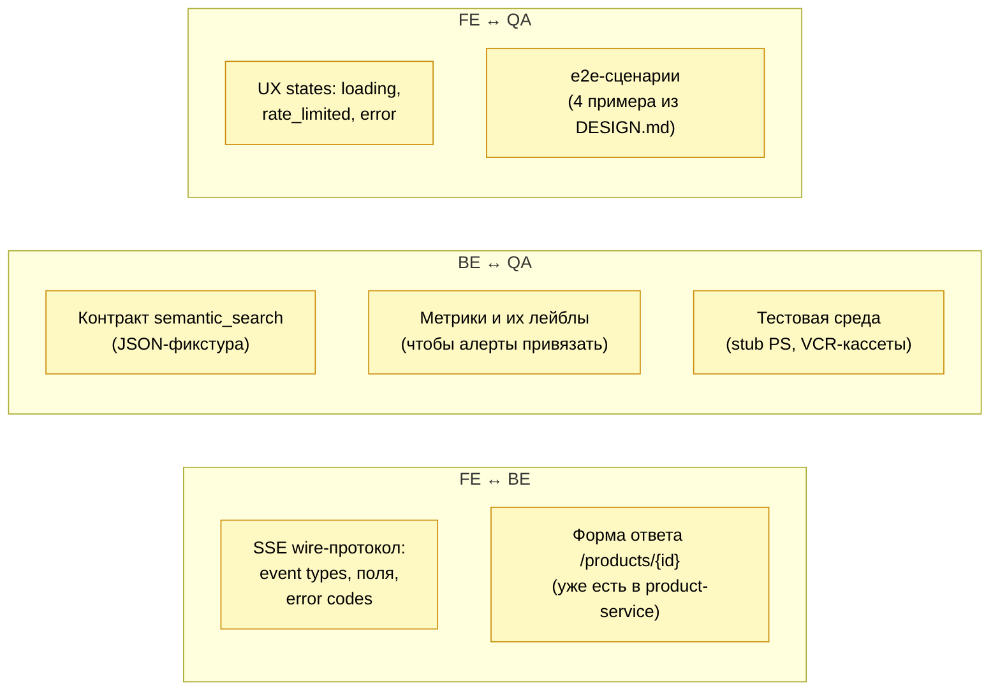
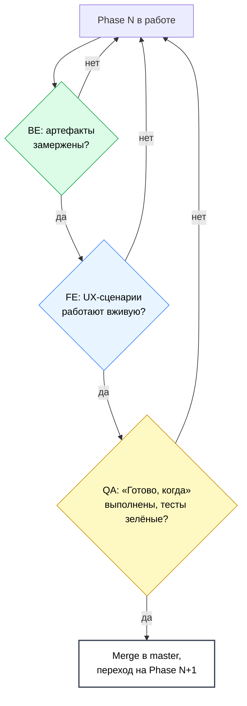

# Stylist Service — разделение ответственности

Дополнение к `ROADMAP.md` и `DESIGN.md`. Делит работу на 3 роли:

- **FE** — Frontend (чат-интерфейс, SSE-клиент, карточки)
- **BE** — Backend / Tech (ai-service, изменения в product-service, nginx, compose, инфра)
- **QA** — Testing / Validation (тесты, eval-датасеты, нагрузка, smoke, мониторинг качества)

Цель документа — чтобы трое не наступали друг другу на ноги и было ясно, кто за какой артефакт отвечает.

---

## Scope каждой роли

### FE — Frontend

**Владеет:**
- Чат-страницей в клиенте (вход в сервис).
- SSE-клиентом: парсинг `event: token / products / ping / error / done`.
- Стейтом разговора на стороне фронта (`conversation_id`, render истории, индикаторы «печатает»).
- Карточками товаров: после `event: products` подгружает `GET /products/{id}` параллельно для каждого id, рендерит с лоадерами.
- Обработкой ошибок UX-side: rate_limited → баннер «лимит исчерпан», upstream_unavailable → «сервис временно недоступен», bad_request → «попробуйте перефразировать».
- Reconnect-стратегией (для MVP — кнопка «попробовать ещё раз», без авто-resume).
- Локализацией интерфейса (тексты по-русски, ₽, форматы дат/чисел).
- Доступностью (a11y) для чата.

**Не владеет:**
- SSE-протоколом и набором event-кодов (это контракт от BE — FE его потребляет, изменения через BE).
- Содержимым системного промпта.
- Структурой ответа `GET /products/{id}` (это контракт product-service — FE использует, не меняет).

### BE — Backend / Tech

**Владеет:**
- Всем кодом `server/ai-service/` (FastAPI app, tool-use loop, конфиг, наблюдаемость).
- Изменениями в `server/product-service/` для Phase 0: миграция pgvector, embedder job, internal endpoint `POST /internal/products/semantic-search`.
- Системным промптом v0–v1 (содержимое — обсуждается с QA, но коммитит BE).
- `nginx/nginx.conf` — секция `/api/stylist/`, SSE-настройки.
- `assets/docker-compose.ai.yml`, `docker-compose.ai.prod.yml`, корневой compose.
- Управлением секретами: `OPENAI_API_KEY`, `INTERNAL_API_TOKEN` в dev/prod env.
- Метриками Prometheus и структурированными логами.
- Деплоем на стейдж/прод.

**Не владеет:**
- UX-решениями в чат-интерфейсе.
- Eval-датасетом для промпта (его собирает QA).
- Решением «работает или нет» — это критерии QA на каждой фазе.

### QA — Testing / Validation

**Владеет:**
- Pytest unit-тестами (валидация tool-args, бюджет истории, conversation TTL, парсинг SSE).
- Integration-тестами против stub product-service и замоканного OpenAI (VCR-кассеты).
- Контрактным тестом `tests/contracts/semantic_search.json` — общий для AI и PS (поддерживает QA, читают обе стороны).
- Smoke-тестом `scripts/smoke-stylist.sh` (4 примера из DESIGN.md → `event: done` без error).
- Eval-датасетом для качества подбора: 30+ запросов с ручной разметкой (релевантно/нет), прогоны по semantic_search и search_products.
- Нагрузкой: локальный load-тест на 50 RPS (для Phase 5).
- Мониторингом качества в проде: дашборд по `stylist_*` метрикам, алерты на p95 latency и error rate.
- Регрессионным контролем: при смене модели (gpt-4o-mini → gpt-4o) прогон evaluation датасета и сравнение метрик.
- Финальной приёмкой каждой фазы — пункт «Готово, когда…» из ROADMAP.md.

**Не владеет:**
- Реализацией кода (тесты — да, прод-код — нет).
- Содержимым промпта (но даёт фидбек: «на запрос X промпт даёт Y, ожидалось Z»).

---

## Разбивка по фазам

| Фаза | FE | BE | QA |
|---|---|---|---|
| **P0** product-service pgvector | — | миграция, embedder job, `/internal/semantic-search`, защита X-Internal-Token | unit-тесты на `text_hash` стабильность; контроль, что `is_deleted/!ready` исключаются; latency-замер top-10 < 100ms p95 |
| **P1** каркас ai-service | стаб-страница `/stylist` (заглушка), проверить, что 401 без JWT | `pyproject.toml`, Dockerfile, FastAPI скелет, `/healthz`, `/metrics`, nginx-блок, compose | health-check тест, e2e: `whoami` без/с JWT |
| **P2** chat без tools | SSE-клиент, рендер потока токенов, базовый UI чата, `POST/DELETE /conversations` | conversation store, OpenAI-обёртка, SSE handler, budget trim, системный промпт v0 | unit на budget/TTL, integration с моком OpenAI, ручной smoke «привет» |
| **P3** точечный поиск | `event: products` → подгрузка карточек через product-service, рендер списка | httpx-клиент, tools `search_products`/`list_facets`, tool-use loop, hard-cap iterations | integration: stub PS → пример 1; контроль, что невалидный tag не вешает loop |
| **P4** semantic + drill-in | follow-up-сообщения с подгрузкой контекста, drill-in UX (ссылка на «расскажи подробнее про N») | `semantic_search`, `get_product_details`, `last_product_ids`, embeddings cap | контрактный тест `semantic_search.json`, eval-датасет 30 запросов, примеры 2 и 3 в smoke |
| **P5** лимиты и устойчивость | UX rate_limited / upstream_unavailable баннеры, отображение `event: error` | rate-limit, circuit-breaker, метрики, логи без user content на info | load-тест 50 RPS, отключение PS/OpenAI и проверка graceful degradation |
| **P6** релиз | прод-сборка фронта, проверка прод-конфига | прод-compose, `.env.example`, README, secrets в проде | прохождение smoke на проде, дашборд метрик зелёный |
| **P7+** post-MVP | интеграция с историей просмотров, feedback UI (лайк/дизлайк) | Redis для истории, push-обновление эмбеддингов, re-ranking | расширение eval-датасета, A/B-инфра, метрики качества рекомендаций |

---

## RACI по ключевым артефактам

`R` — делает, `A` — accountable (финальная ответственность), `C` — consulted, `I` — informed.

| Артефакт | FE | BE | QA |
|---|---|---|---|
| Системный промпт | C | R/A | C |
| SSE wire-протокол (events, codes) | C | R/A | C |
| Tool JSON schemas | I | R/A | C |
| Чат-страница и UI | R/A | C | C |
| `event: products` → карточки на фронте | R/A | C | I |
| Миграция pgvector | I | R/A | C |
| `/internal/semantic-search` контракт | I | R/A | C |
| Контрактный тест `semantic_search.json` | I | C | R/A |
| Eval-датасет (30+ запросов) | I | C | R/A |
| Load-тест | I | C | R/A |
| Smoke-скрипт `scripts/smoke-stylist.sh` | I | C | R/A |
| nginx `/api/stylist/` location | I | R/A | C |
| docker-compose dev/prod | I | R/A | I |
| `.env.example` и секреты | I | R/A | I |
| README в `ai-service` | I | R/A | C |
| Прод-деплой | I | R/A | C |
| Дашборд метрик и алерты | I | C | R/A |
| Промпт-регрессии при смене модели | I | C | R/A |

---

## Точки стыковки (где трое договариваются)

Это не зоны ответственности, а контракты — должны быть согласованы заранее, чтобы не переделывать.

Каждая стыковка — отдельный мини-контракт, фиксируется PR-ом или строчкой в `DESIGN.md` ещё до того, как кто-то начинает писать соответствующий код.

---

## Definition of Done на фазу — кто что подтверждает

QA — последняя дверь. Без её «да» фаза не закрывается, даже если код смержен.

---

## Что НЕ должно случаться (анти-паттерны)

- **FE пишет SSE-протокол под себя** и просит BE подстроиться. Протокол — собственность BE, FE может предложить изменение через PR в DESIGN.md.
- **BE пишет тесты «для галочки»** и считает, что фаза готова. Приёмка — у QA, по критериям ROADMAP.md.
- **QA правит прод-код**, чтобы тест прошёл. Если тест красный, QA открывает issue / PR с воспроизведением, BE чинит.
- **Любая роль делает работу другой роли в обход**: «я быстренько подкручу». Фиксируем в issue, обсуждаем, потом делаем.
- **Промпт меняется без прогона eval-датасета** на нём. После Phase 4 любая правка системного промпта = QA-прогон.

---

## Размер ролей

Не равный, и это нормально.

- BE — самый большой объём (≈ 60% работы по объёму кода). Сосредоточен на P0 + P2–P5.
- FE — ≈ 25%. Самая нагруженная фаза — P2 (новый UI чата) и P3 (карточки + `event: products`).
- QA — ≈ 15% по коду, но критическая роль на P4 (eval) и P5 (нагрузка) и постоянная роль в каждой приёмке.

В моменты пиков (например, релиз P6) роли могут заходить друг к другу — но только по согласованию, а не явочным порядком.
