# Stylist Service — roadmap в диаграммах

Визуальное дополнение к `ROADMAP.md`. Текстовые критерии готовности и список артефактов — там; здесь — связи, последовательность и состояние системы по фазам.

## Граф зависимостей фаз

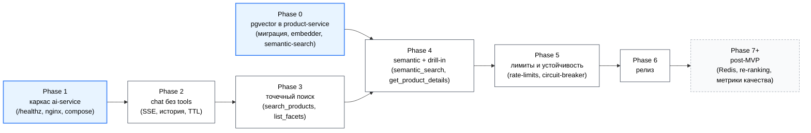

Голубые узлы (P0, P1) могут идти параллельно. Серые (P7+) — после релиза, без жёсткого порядка.

## Критический путь

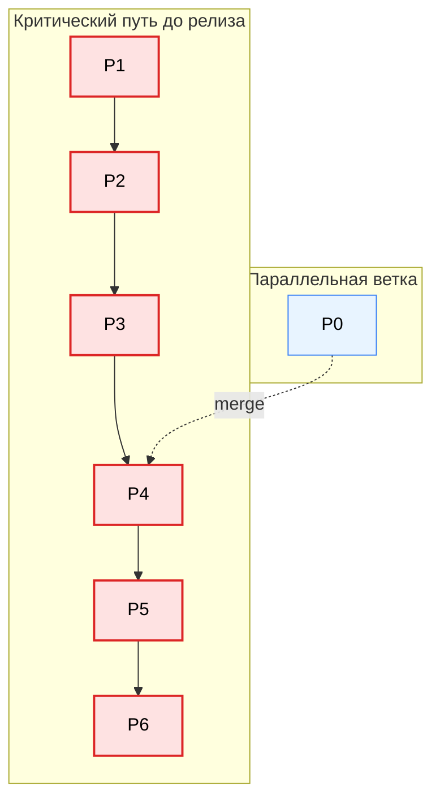

Если Phase 0 не успевает к старту Phase 4 — релиз отодвигается. Это единственная межсервисная зависимость, всё остальное локально в `ai-service`.

## Условный таймлайн (Gantt)

Длительности — в условных «единицах работы» (1 ед. ≈ 1–2 рабочих дня), не в календарных днях. Для оценки порядка, не дат.

```mermaid
gantt
    title Roadmap Stylist Service
    dateFormat  X
    axisFormat  %s
    section product-service
    Phase 0 — pgvector + embedder        :p0, 0, 5
    section ai-service
    Phase 1 — каркас                      :p1, 0, 2
    Phase 2 — chat без tools              :p2, after p1, 3
    Phase 3 — search_products + facets    :p3, after p2, 3
    Phase 4 — semantic + drill-in         :p4, after p3, 3
    Phase 5 — лимиты и устойчивость       :p5, after p4, 3
    Phase 6 — релиз                       :p6, after p5, 1
    section post-MVP
    Phase 7+                              :p7, after p6, 5
```

## Эволюция архитектуры по фазам

### После Phase 1

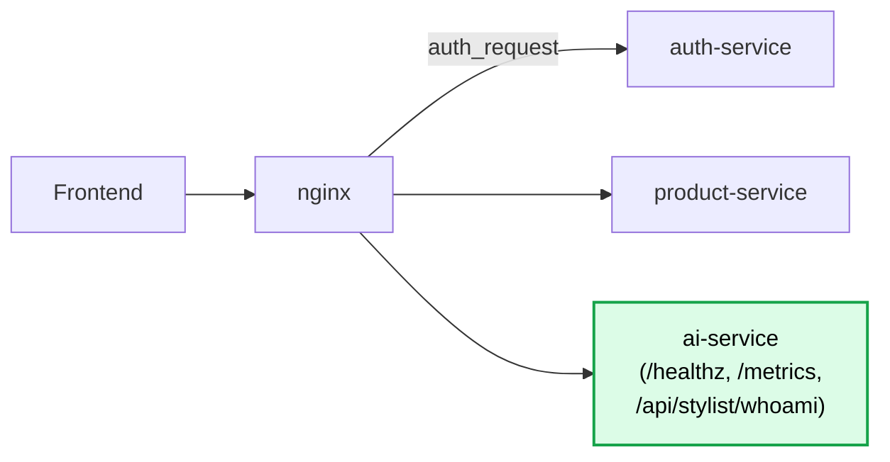

Сервис поднимается, проходит auth, но ничего полезного не делает.

### После Phase 3

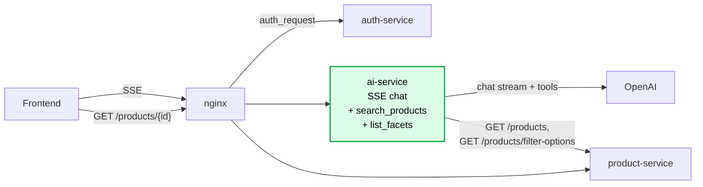

Точечные запросы работают end-to-end. Размытых запросов и drill-in ещё нет.

### После Phase 4 (MVP-функциональность)

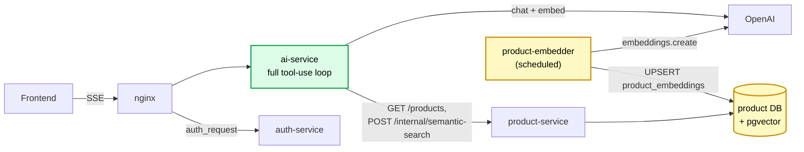

Жёлтым — компоненты Phase 0 (`product-embedder`, `pgvector` в product DB). Зелёным — то, что добавилось/расширилось в Phase 4.

## Покрытие сценариев из DESIGN.md

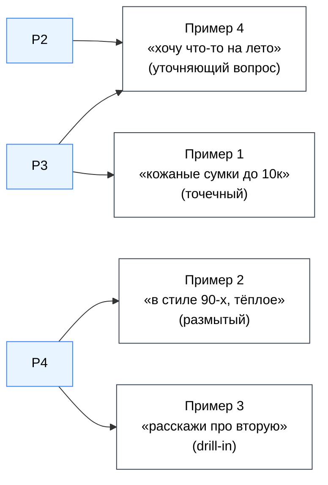

Пример 4 (уточняющий вопрос) формально работает уже после Phase 2 — модель сама задаёт вопрос без tool-use. Полное качество — после обновления промпта в Phase 3.

## Tool-use loop (как становится сложнее по фазам)

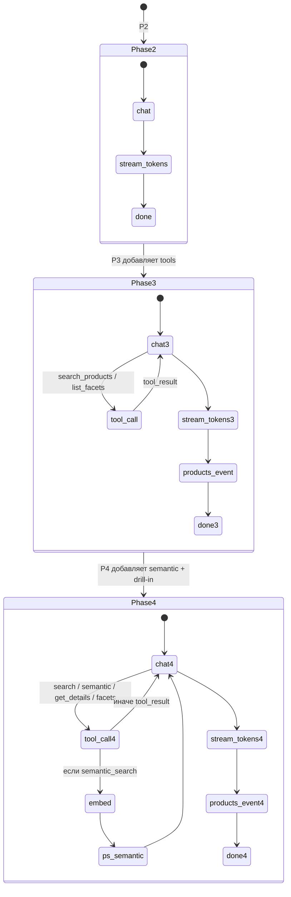

## Что включается и где (по компонентам)

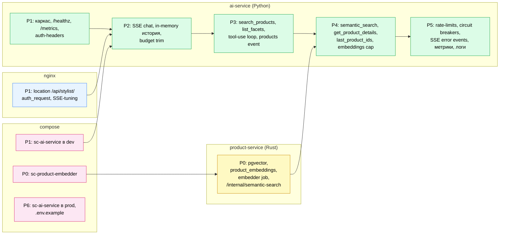

## Definition of Done — флоу принятия фазы

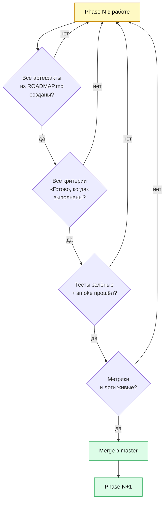

## Риски на критическом пути

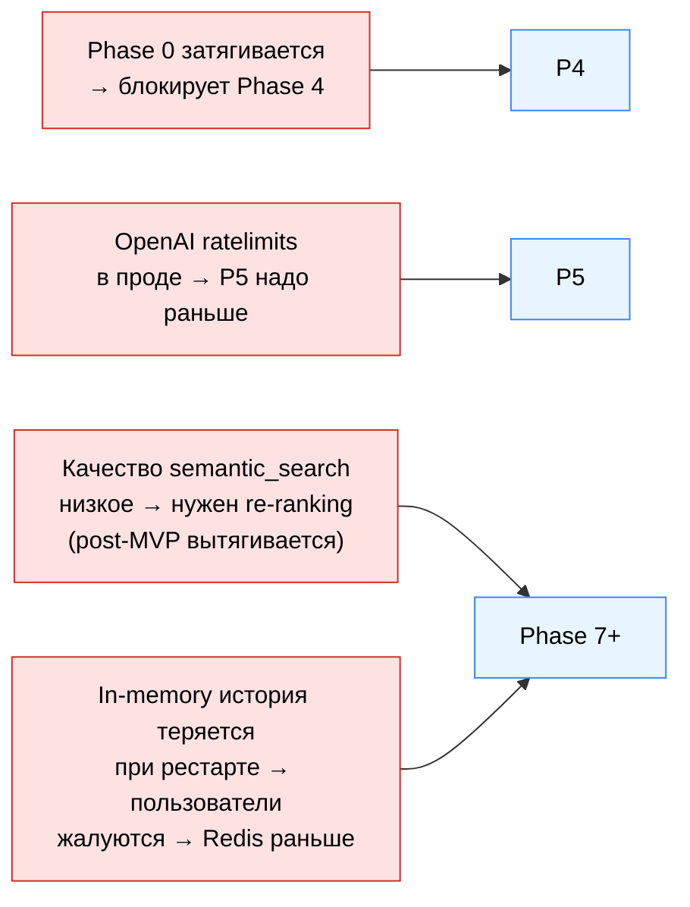

Митигации описаны в `DESIGN.md` (секции «Обработка ошибок и сбои зависимостей» и «Что вне MVP»).
