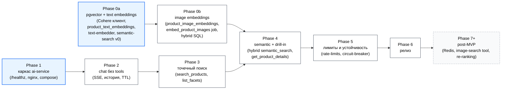
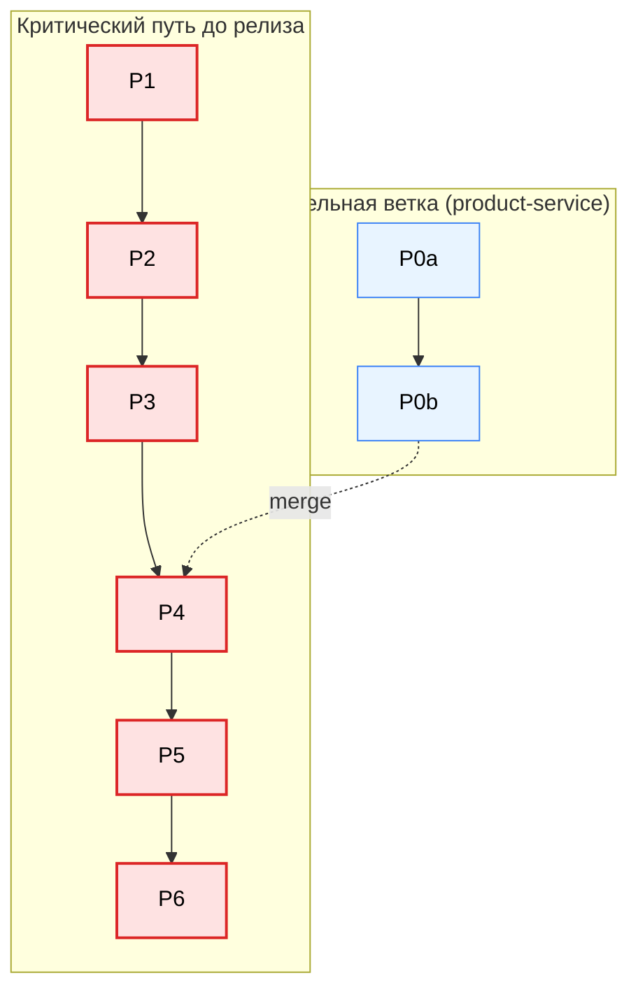
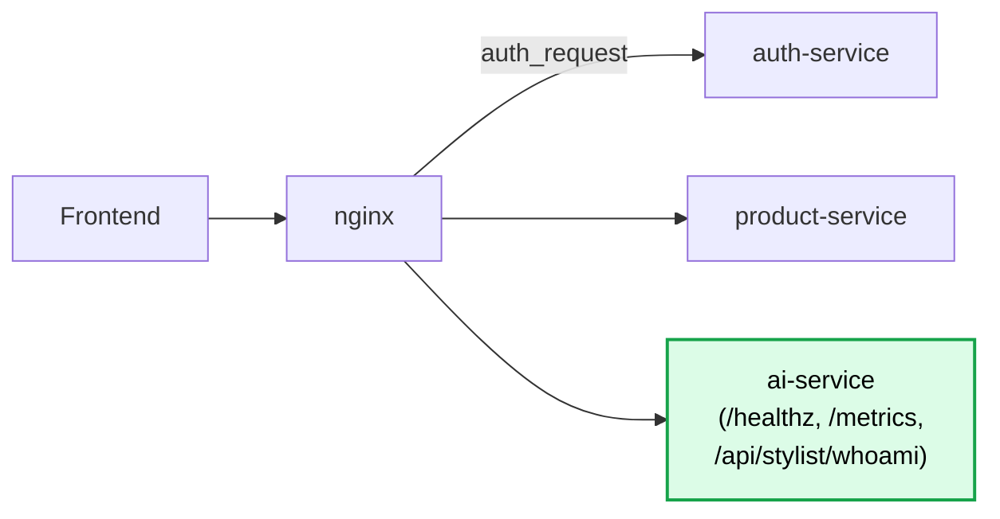
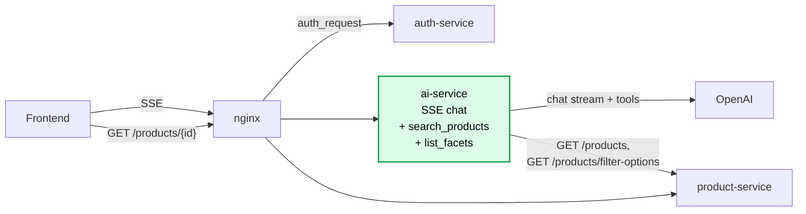
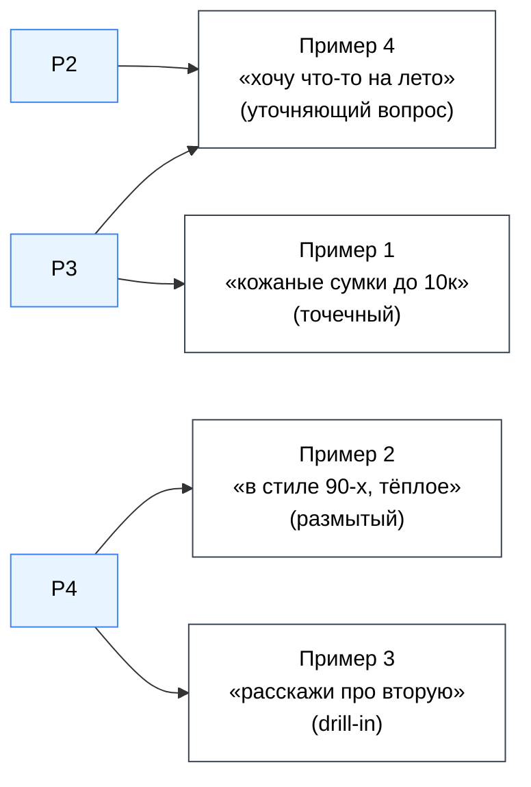
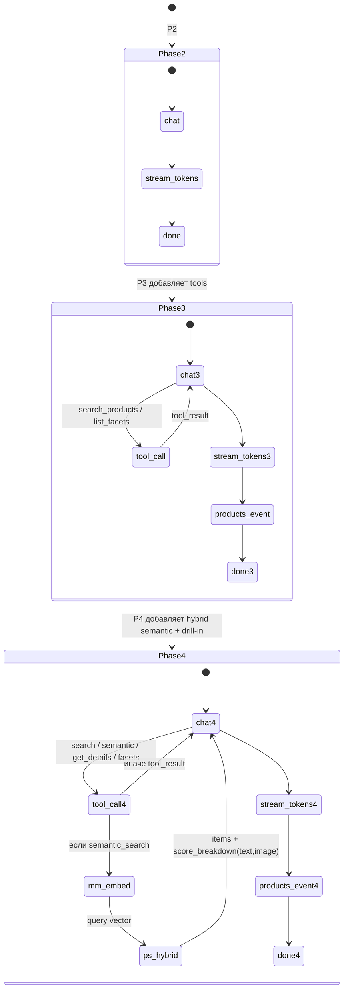
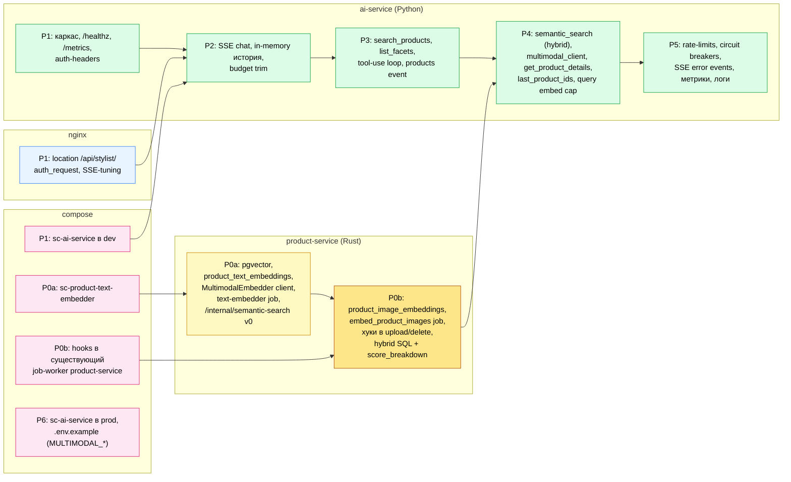
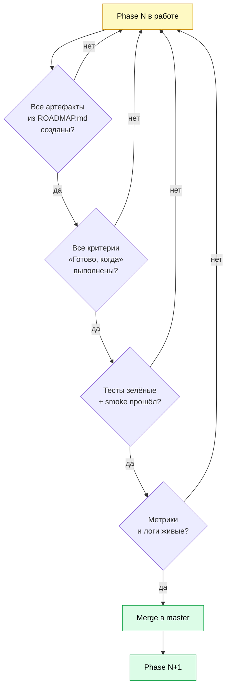
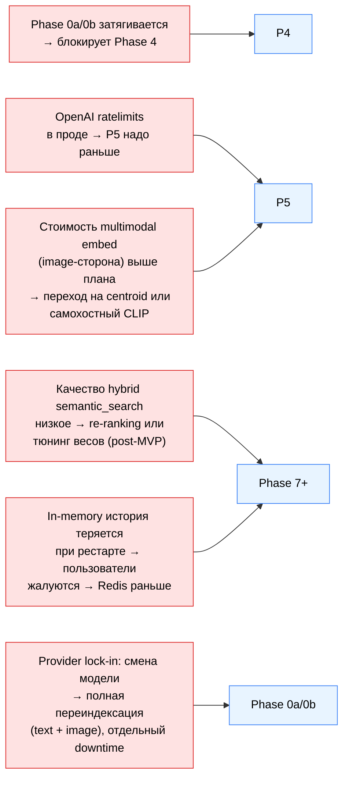

# Stylist Service — roadmap в диаграммах

Визуальное дополнение к `ROADMAP.md`. Текстовые критерии готовности и список артефактов — там; здесь — связи, последовательность и состояние системы по фазам.

## Граф зависимостей фаз



Голубые узлы (P0a, P1) могут идти параллельно. P0b ждёт 0a (нужен `MultimodalEmbedder`-клиент и зафиксированный провайдер), но может идти параллельно с P2–P3. Серые (P7+) — после релиза, без жёсткого порядка.

## Критический путь



Если Phase 0a+0b не успевают к старту Phase 4 — релиз отодвигается. Это единственная межсервисная зависимость, всё остальное локально в `ai-service`. Внутри ветки P0b следует строго после P0a (общий `MultimodalEmbedder`-клиент и зафиксированный провайдер).

## Условный таймлайн (Gantt)

Длительности — в условных «единицах работы» (1 ед. ≈ 1–2 рабочих дня), не в календарных днях. Для оценки порядка, не дат.

```mermaid
gantt
    title Roadmap Stylist Service
    dateFormat  X
    axisFormat  %s
    section product-service
    Phase 0a — pgvector + text embed     :p0a, 0, 4
    Phase 0b — image embed + hybrid SQL  :p0b, after p0a, 3
    section ai-service
    Phase 1 — каркас                      :p1, 0, 2
    Phase 2 — chat без tools              :p2, after p1, 3
    Phase 3 — search_products + facets    :p3, after p2, 3
    Phase 4 — hybrid semantic + drill-in  :p4, after p3, 3
    Phase 5 — лимиты и устойчивость       :p5, after p4, 3
    Phase 6 — релиз                       :p6, after p5, 1
    section post-MVP
    Phase 7+                              :p7, after p6, 5
```



## Эволюция архитектуры по фазам

### После Phase 1



Сервис поднимается, проходит auth, но ничего полезного не делает.

### После Phase 3



Точечные запросы работают end-to-end. Размытых запросов и drill-in ещё нет.

### После Phase 4 (MVP-функциональность)

```mermaid
flowchart LR
    FE[Frontend]
    NG[nginx]
    AS[auth-service]
    AI["ai-service<br/>full tool-use loop"]
    OAI[OpenAI<br/>chat only]
    ME[Multimodal Embed API]
    PS[product-service]
    TEMB["product-text-embedder<br/>(scheduled)"]
    IEMB["embed_product_images<br/>job (триггер: upload/delete)"]
    S3[(S3<br/>products/{id}/{n}/{variant}.webp)]
    DB[(product DB + pgvector<br/>product_text_embeddings,<br/>product_image_embeddings)]

    FE -- SSE --> NG --> AI
    NG -- auth_request --> AS
    AI -- chat --> OAI
    AI -- embed_text(query) --> ME
    AI -- GET /products,<br/>POST /internal/semantic-search --> PS
    PS -- hybrid SQL: text + MAX(image) --> DB
    TEMB -- embed_text(generate_product_text) --> ME
    TEMB -- UPSERT product_text_embeddings --> DB
    IEMB -- GET medium.webp --> S3
    IEMB -- embed_image(bytes) --> ME
    IEMB -- UPSERT product_image_embeddings --> DB

    classDef p0a fill:#fef9c3,stroke:#ca8a04,stroke-width:2px,color:#000
    classDef p0b fill:#fde68a,stroke:#b45309,stroke-width:2px,color:#000
    classDef p4 fill:#dcfce7,stroke:#16a34a,stroke-width:2px,color:#000
    class TEMB p0a
    class IEMB,S3 p0b
    class DB p0a
    class AI,ME p4
```

Жёлтым — компоненты Phase 0a (`product-text-embedder`, text-таблица в pgvector). Тёмно-жёлтым — Phase 0b (`embed_product_images` job, image-таблица, S3 как источник для картинок). Зелёным — то, что добавилось/расширилось в Phase 4 (multimodal-клиент в `ai-service`, hybrid score). OpenAI остался только в chat-канале.

## Покрытие сценариев из DESIGN.md



Пример 4 (уточняющий вопрос) формально работает уже после Phase 2 — модель сама задаёт вопрос без tool-use. Полное качество — после обновления промпта в Phase 3.

## Tool-use loop (как становится сложнее по фазам)



## Что включается и где (по компонентам)



## Definition of Done — флоу принятия фазы



## Риски на критическом пути



Митигации описаны в `DESIGN.md` (секции «Обработка ошибок и сбои зависимостей» и «Что вне MVP»).
